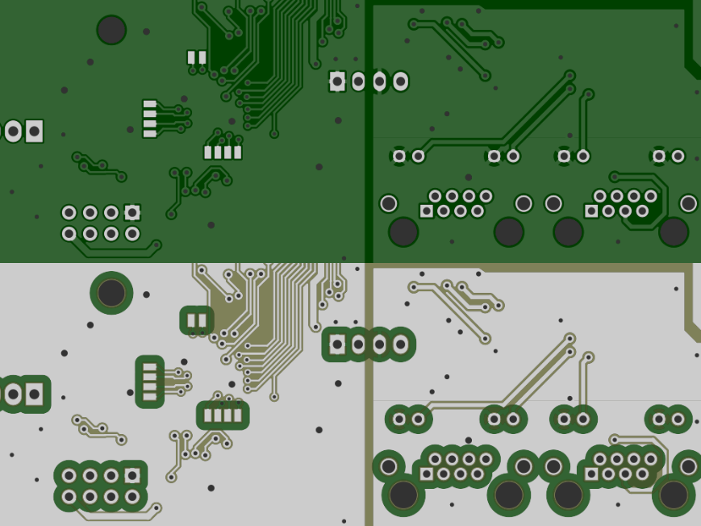

.. _examples-doc:

Examples
========

Solder mask rings
-----------------

This example script takes a board exported with a more recent KiCad version, and removes solder mask everywhere, but
leaves a thin ring of solder mask around every pad. Might be useful for some artsy boards.

.. code-block:: python
    from gerbonara import *
    from shapely import *

    stack = layers.LayerStack.open('gerber')
    # Let's work in mm here. Gerbonara will take care to convert units when the file is in US customary units.
    (x1, y1), (x2, y2) = stack.bounding_box(unit=utils.MM)

    for l in [stack['bottom mask'], stack['top mask']]:

        # The solder mask gerber layer by convention is "negative". That is, a "dark" polarity (drawn) Gerber primitive
        # will result in an opening in the solder mask. Conversely, an empty gerber file would lead to the entire board
        # being covered in solder mask.
        #
        # Here, we add a rectangle covering the entire board so the entire board is *free* of solder mask.

        new = [graphic_objects.Region(
            [(x1, y1), (x1, y2), (x2, y2), (x2, y1), (x1, y1)],
            unit=utils.MM,
            polarity_dark=True)]

        # Iterate through all objects on the solder mask layer. In later KiCad versions, everything on the solder mask
        # layer is exported as a Gerber region, which is a really bad idea, but makes things easy for us here.
        for obj in l.objects:
            if isinstance(obj, gerbonara.graphic_objects.Region):
                regions = []
            else:
                regions = [gerbonara.graphic_objects.Region.from_arc_poly(prim.to_arc_poly())
                    for prim in obj.to_primitives(unit=gerbonara.utils.MM)]

            for obj in regions:
                # Convert the region to a shapely line string
                ls = LineString(obj.outline).normalize()

                # Ask shapely to offset the line string by 1 mm
                out = ls.offset_curve(obj.unit(1, 'mm'))

                # For negative offsets, this operation can result in an object being split up into multiple parts, so we
                # might get back a MultiLineString instead of a LineString.
                for ls in (out.geoms if hasattr(out, 'geoms') else [out]):

                    # Convert the resulting shapely object back to a Gerber region.
                    new.append(graphic_objects.Region(
                        unit=obj.unit,
                        polarity_dark=not obj.polarity_dark,
                        outline=list(ls.coords)))

        # Append the new objects to the original layer data
        l.objects = new + l.objects
    # Write the modified layer stack to a new Gerber directory
    stack.save_to_directory('output-gerbers')
